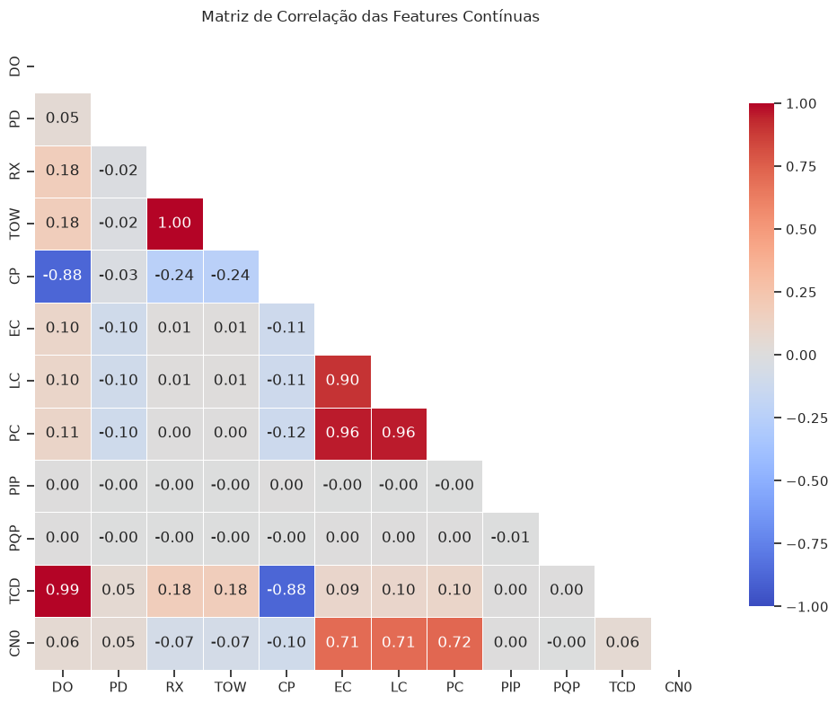
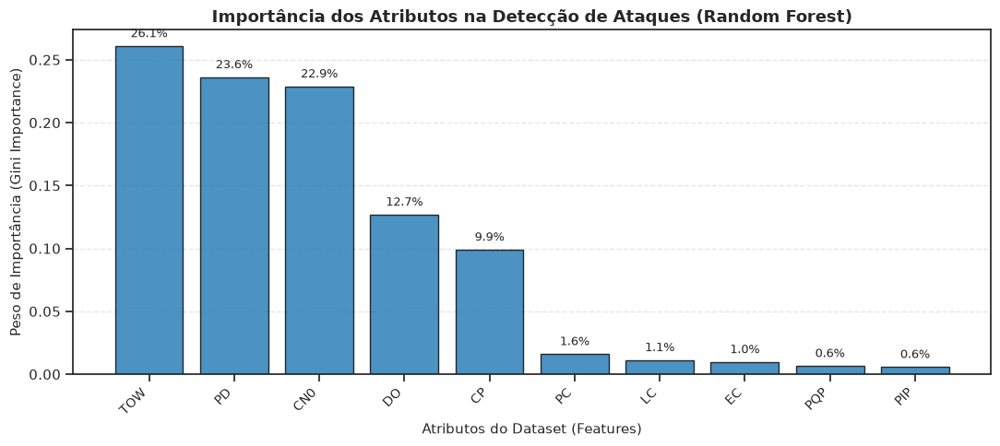
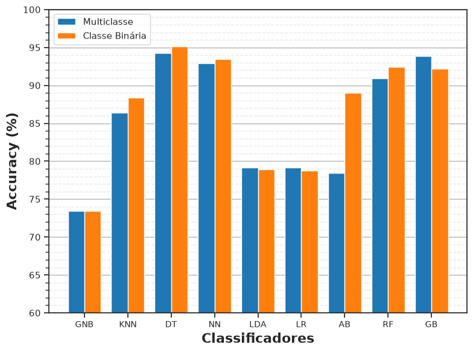
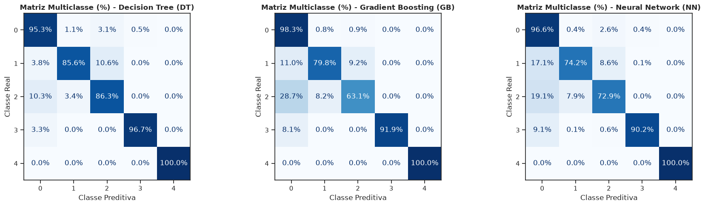
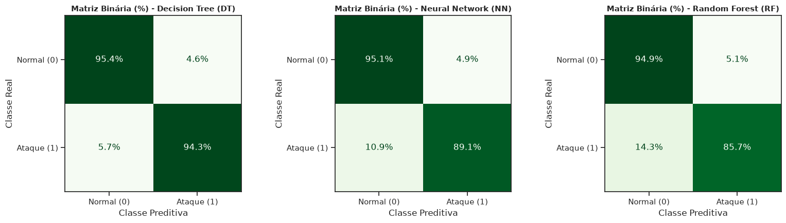
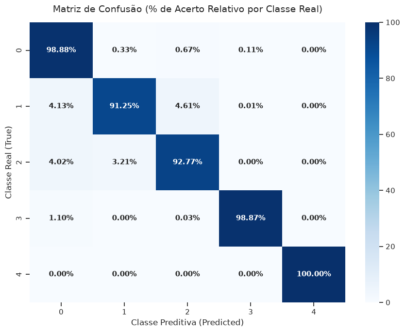

# Avaliação de modelos de Machine Learning na Detecção de Ataques GNSS (Spoofing & Jamming) em VANTs

Este repositório contém uma investigação avançada sobre a aplicação de algoritmos de **Machine Learning** na identificação de interferências maliciosas e ataques de cibersegurança em **Veículos Aéreos Não Tripulados (VANTs / Drones)**. 

Trata-se de uma expansão de estudos anteriores sobre a segurança de sistemas aéreos, incorporando agora a classificação multiclasse não apenas de múltiplos níveis de **Spoofing de GPS**, mas também de cenários de **Jamming**. O projeto se trata principalmente da tentativa de replicação de um artigo científico publicado no SBSeg 2024.

---

## Contexto & Base de Dados

Os dados utilizados neste estudo têm como base o trabalho dos pesquisadores **Gustavo Gualberto Rocha de Lemos** e **Rodrigo Augusto Cardoso da Silva**. A coleta foi realizada a partir de um **receptor GNSS de 8 canais** embarcado em drones reais.

O dataset é composto por **13 features técnicas** extraídas continuamente nos 8 canais paralelos de satélites visíveis.

### Classes de Sinais Analisadas
1. **Sinal Autêntico:** Operação normal do receptor GNSS.
2. **Spoofing Simplista:** Injeção de sinais sem alinhamento fino de fase/frequência.
3. **Spoofing Intermediário:** Falsificação com sincronização parcial de parâmetros.
4. **Spoofing Sofisticado:** Falsificação coordenada de alta precisão.
5. **Jamming:** Interferência intencional por ruído/potência para bloqueio do canal.

---

## Features do Dataset

| Feature | Descrição Técnica | Unidade |
| :--- | :--- | :---: |
| **`PRN`** | *Pseudo-Random Noise:* Identificador único do satélite | ID |
| **`DO`** | *Carrier Doppler:* Deslocamento Doppler da portadora | Hz |
| **`PD`** | *Pseudorange:* Pseudodistância estimada até o satélite | m |
| **`RX`** | Tempo de recepção registrado pelo receptor | s |
| **`TOW`** | *Time of Week:* Tempo decorrido desde o início da semana GPS | s |
| **`CP`** | *Carrier Phase Cycles:* Diferença de fase da portadora (ciclos) | ciclos |
| **`EC`** | *Early Correlator:* Saída do correlator antecipado ($\frac{1}{2}$ chip) | - |
| **`LC`** | *Late Correlator:* Saída do correlator atrasado ($\frac{1}{2}$ chip) | - |
| **`PC`** | *Prompt Correlator:* Medida de correlação do sinal recebido | - |
| **`PIP`** | *Prompt In-Phase Component:* Componente em fase ($I$) do correlator | - |
| **`PQP`** | *Prompt Quadrature Component:* Componente em quadratura ($Q$) do correlator | - |
| **`TCD`** | *Tracking Carrier Doppler:* Doppler estimado pelos loops de rastreio | Hz |
| **`CN0`** | *Carrier-to-Noise Ratio:* Relação sinal-ruído da portadora | dB-Hz |

---

## Metodologia & Pipeline

O fluxo de trabalho foi desenhado para respeitar as restrições físicas de séries temporais embarcadas em hardware de drones:

1. **Análise Exploratória & Estatística:** Avaliação da distribuição de sinais e verificação de dependências lineares/não-lineares via **Matriz de Correlação de Spearman**.
2. **Pré-processamento Consciente:** Tratamento de tipos de dados, formatação decimal e validação de consistência sem perda de dinâmica de temporalidade.
3. **Engenharia de Features:** Extração de métricas derivativas para capturar inconsistências físicas (ex: discrepâncias entre Doppler e TCD).
4. **Modelagem Multiclasse:** Treinamento de modelos de classificação ensemble e baseados em árvores/kernels otimizados para detecção com baixo tempo de inferência.

  

  

---

## Resultados & Comparação de Modelos

A avaliação foi dividida em duas abordagens de detecção: **Multiclasse** (classificação exata do estado/ataque) e **Binária** (sinal autêntico vs. sob ataque).

### 1. Visão Geral do Desempenho (Acurácia Global)

| Classificador | Sigla | Multiclasse (%) | Binário (%) | Observação |
| :--- | :---: | :---: | :---: | :--- |
| **Stacking (Ensemble)** | **Stacking** | **98.00%** | **-** | **Top Performer (combina os melhores modelos)** |
| **Decision Tree** | **DT** | **94.24%** | **95.14%** | **Melhor modelo individual** |
| Gradient Boosting | GB | 93.88% | 92.23% | Alta precisão geral |
| Neural Network (MLP) | NN | 92.94% | 93.49% | Desempenho sólido |
| Random Forest | RF | 90.91% | 92.46% | Robusto, equilibrado em todas as classes |
| K-Nearest Neighbors | KNN | 86.38% | 88.38% | Perfeito na Classe 4 (Jamming) |
| AdaBoost | AB | 78.40% | 89.05% | Ganho expressivo no cenário binário |
| Linear Discriminant Analysis | LDA | 79.20% | 78.91% | Dificuldade em distinguir nuances de spoofing |
| Logistic Regression | LR | 79.17% | 78.76% | Baseline linear |
| Gaussian Naive Bayes | GNB | 73.46% | 73.46% | Baseline estatístico |

  

---

### Matrizes de Confusão

#### Modelos Multiclasse e Binários Individuais
<table>
  <tr>
    <td align="center">
      <b>Modelos Multiclasse (DT, GB, NN)</b> 
      
    </td>
    <td align="center">
      <b>Modelos Binários (DT, NN, RF)</b> 
      
    </td>
  </tr>
</table>

#### Modelo Bônus (Stacking Classifier)

  

---

> **Insight Principal:** A classe 4 (**Jamming**) foi detectada com **100% de precisão e recall** nos modelos baseados em árvore, KNN e Stacking, comprovando que as anomalias causadas por ruído em potência (ex: comportamento atípico do $C/N_0$) criam uma assinatura física inquestionável no dataset.

 <b>Clique aqui para expandir os Relatórios de Classificação Detalhados</b>

 

### Relatórios Multiclasse

<b>Decision Tree (DT) — Acurácia: 94.24%</b>
<pre><code>              precision    recall  f1-score   support
     Class 0     0.9819    0.9527    0.9671     99412
     Class 1     0.8404    0.8555    0.8479      9110
     Class 2     0.6995    0.8631    0.7728     11053
     Class 3     0.9426    0.9672    0.9548      7999
     Class 4     1.0000    1.0000    1.0000      7755
   macro avg     0.8929    0.9277    0.9085    135329
weighted avg     0.9480    0.9424    0.9443    135329</code></pre>

<b>Gradient Boosting (GB) — Acurácia: 93.88%</b>
<pre><code>              precision    recall  f1-score   support
     Class 0     0.9529    0.9828    0.9676     99412
     Class 1     0.8128    0.7978    0.8052      9110
     Class 2     0.8012    0.6311    0.7060     11053
     Class 3     0.9934    0.9192    0.9549      7999
     Class 4     1.0000    1.0000    1.0000      7755
   macro avg     0.9121    0.8662    0.8867    135329
weighted avg     0.9362    0.9388    0.9364    135329</code></pre>

<b>Neural Network (NN) — Acurácia: 92.94%</b>
<pre><code>              precision    recall  f1-score   support
     Class 0     0.9561    0.9655    0.9608     99412
     Class 1     0.8398    0.7422    0.7879      9110
     Class 2     0.7027    0.7293    0.7158     11053
     Class 3     0.9415    0.9021    0.9214      7999
     Class 4     1.0000    1.0000    1.0000      7755
   macro avg     0.8880    0.8678    0.8772    135329
weighted avg     0.9293    0.9294    0.9291    135329</code></pre>

<b>Random Forest (RF) — Acurácia: 90.91%</b>
<pre><code>              precision    recall  f1-score   support
     Class 0     0.9486    0.9487    0.9487     99412
     Class 1     0.7539    0.7682    0.7609      9110
     Class 2     0.6020    0.5936    0.5978     11053
     Class 3     0.9279    0.9245    0.9262      7999
     Class 4     1.0000    1.0000    1.0000      7755
   macro avg     0.8465    0.8470    0.8467    135329
weighted avg     0.9089    0.9091    0.9090    135329</code></pre>

<b>KNN — Acurácia: 86.38%</b>
<pre><code>              precision    recall  f1-score   support
     Class 0     0.8652    0.9859    0.9216     99412
     Class 1     0.7575    0.4923    0.5968      9110
     Class 2     0.7249    0.3459    0.4683     11053
     Class 3     0.9131    0.3534    0.5096      7999
     Class 4     0.9996    1.0000    0.9998      7755
   macro avg     0.8521    0.6355    0.6992    135329
weighted avg     0.8570    0.8638    0.8429    135329</code></pre>

### Relatórios Binários (Sinal Autêntico vs. Ataque)

<b>Decision Tree (DT) — Binário</b>
<pre><code>              precision    recall  f1-score   support
           0     0.9789    0.9544    0.9665     99412
           1     0.8820    0.9430    0.9115     35917
    accuracy                         0.9514    135329
   macro avg     0.9304    0.9487    0.9390    135329
weighted avg     0.9532    0.9514    0.9519    135329</code></pre>

<b>Neural Network (NN) — Binário</b>
<pre><code>              precision    recall  f1-score   support
           0     0.9601    0.9509    0.9555     99412
           1     0.8677    0.8906    0.8790     35917
    accuracy                         0.9349    135329
   macro avg     0.9139    0.9207    0.9172    135329
weighted avg     0.9356    0.9349    0.9352    135329</code></pre>

<b>Random Forest (RF) — Binário</b>
<pre><code>              precision    recall  f1-score   support
           0     0.9484    0.9489    0.9487     99412
           1     0.8583    0.8573    0.8578     35917
    accuracy                         0.9246    135329
   macro avg     0.9034    0.9031    0.9032    135329
weighted avg     0.9245    0.9246    0.9245    135329</code></pre>

<b>Gradient Boosting (GB) — Binário</b>
<pre><code>              precision    recall  f1-score   support
           0     0.9130    0.9883    0.9492     99412
           1     0.9581    0.7395    0.8347     35917
    accuracy                         0.9223    135329
   macro avg     0.9356    0.8639    0.8919    135329
weighted avg     0.9250    0.9223    0.9188    135329</code></pre>

<b>AdaBoost (AB) — Binário</b>
<pre><code>              precision    recall  f1-score   support
           0     0.8906    0.9700    0.9286     99412
           1     0.8899    0.6703    0.7646     35917
    accuracy                         0.8905    135329
   macro avg     0.8903    0.8202    0.8466    135329
weighted avg     0.8904    0.8905    0.8851    135329</code></pre>

<b>KNN — Binário</b>
<pre><code>              precision    recall  f1-score   support
           0     0.8786    0.9768    0.9251     99412
           1     0.9071    0.6265    0.7411     35917
    accuracy                         0.8838    135329
   macro avg     0.8928    0.8016    0.8331    135329
weighted avg     0.8862    0.8838    0.8763    135329</code></pre>

---
### Bônus: Stacking Classifier (Ensemble)
Combinando os melhores classificadores individuais em uma arquitetura de Stacking, o modelo alcançou o melhor desempenho na base de testes:

| Classe | Descrição | Precision | Recall | F1-Score | Support |
| :---: | :--- | :---: | :---: | :---: | :---: |
| **0** | Sinal Autêntico | 0.99 | 0.99 | **0.99** | 99.412 |
| **1** | Spoofing Simplista | 0.92 | 0.91 | **0.92** | 9.110 |
| **2** | Spoofing Intermediário | 0.90 | 0.93 | **0.92** | 11.053 |
| **3** | Spoofing Sofisticado | 0.99 | 0.99 | **0.99** | 7.999 |
| **4** | **Jamming** | **1.00** | **1.00** | **1.00** | **7.755** |
| **Acurácia Global** | | | | **0.98** | **135.329** |

Apesar do seu alto desempenho, o stacking se demonstrou um modelo muito lento de rodar, possivelmente inviável na prática para uso on-the-fly nos drones. No meu computador, demorou o triplo, quase quádruplo, para executar em relação a célula dos nove modelos multiclasse (e com certeza pode se esperar um contraste ainda maior se fossem priorizados apenas os modelos individuais vencedores).

## Tecnologias & Bibliotecas

- **Linguagem:** Python 3.x
- **Manipulação de Dados:** `pandas`, `numpy`
- **Visualização de Dados:** `matplotlib`, `seaborn`
- **Machine Learning & Validação:** `scikit-learn`

---

## Autor

Desenvolvido por **Luís Henrique Varela Medeiros Bezerra**  
* Bacharelado em Ciência de Computação (BCC) — **ICMC / USP**  
* GitHub: [@luishvarela](https://github.com/luishvarela)
